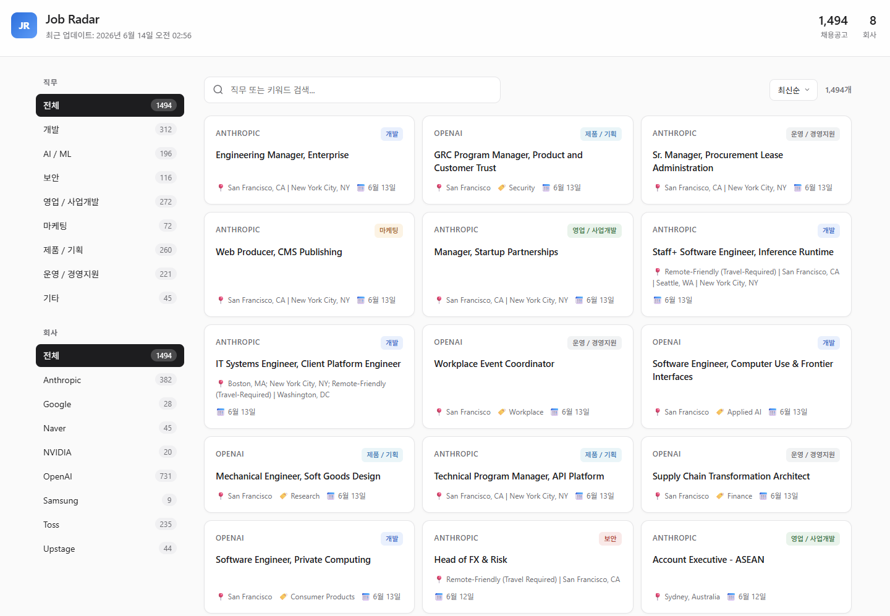

# Job Radar

> Personal job tracker that aggregates openings from 8 top tech companies — built to streamline my own job search.

[](https://python.org)
[](LICENSE)
[](https://github.com/features/actions)

**[Live Demo](https://donghee-ai.github.io/job-radar/)** • **[Architecture](ARCHITECTURE.md)**



---

## Why I Built This

Tired of checking multiple career pages every week, I built a unified dashboard that automatically aggregates job postings from companies I'm interested in — including global tech giants (NVIDIA, OpenAI, Anthropic), Korean IT (Naver, Toss), and AI startups (Upstage).

## Features

- **Multi-source crawling** — Supports Workday, Greenhouse, Ashby, and custom APIs
- **Clean local dashboard** — Apple-inspired UI with category/company filters
- **Manual-first, auto-optional** — Run on demand or enable daily automation
- **Extensible architecture** — Add new companies by inheriting `BaseCrawler`
- **Zero-cost deployment** — Pure static site + GitHub Actions

## Supported Companies

Each company uses a crawling strategy chosen to fit how its career page is built. See [ARCHITECTURE.md](ARCHITECTURE.md#4-crawling-techniques) for the rationale behind each approach.

| Company   | Category      | Crawling Method                      | Why                                                  |
| --------- | ------------- | ------------------------------------ | ---------------------------------------------------- |
| Anthropic | Global        | Greenhouse REST API                  | Public ATS endpoint — fastest and most stable        |
| OpenAI    | Global        | Ashby REST API                       | Public ATS endpoint                                  |
| Google    | Global        | Playwright + JS `evaluate()`         | CSR page; `a.href` property needed for full URLs     |
| NVIDIA    | Global        | Playwright XHR interception (Workday)| Bypasses Workday's 400 bot block via real session    |
| Naver     | IT            | Internal AJAX JSON API               | Direct call to `/rcrt/loadJobList.do` for pagination |
| Samsung   | Manufacturing | Playwright + BeautifulSoup           | Requires JS rendering + selector waits               |
| Toss      | Finance       | Playwright + BeautifulSoup           | Next.js CSR; nav links filtered out                  |
| Upstage   | Startup       | Requests + BeautifulSoup             | SSR page — lightweight static parse                  |

## Setup

### Requirements

- Python 3.11+
- Git

### Installation

```bash
# 1. Clone the repository
git clone https://github.com/donghee-ai/job-radar.git
cd job-radar

# 2. Create and activate a virtual environment
python -m venv venv

# Windows
venv\Scripts\activate
# Mac / Linux
# source venv/bin/activate

# 3. Install dependencies
pip install -r requirements.txt

# 4. Install Playwright browser binaries
#    (pip install alone is not enough — skipping this step breaks the Google/Samsung/Toss/NVIDIA crawlers)
playwright install chromium
```

### Usage

```bash
# Run all crawlers (companies enabled in config.json)
python main.py

# Run specific companies only
python main.py Google NVIDIA Toss

# Force-run every company
python main.py --all

# Open the local dashboard
python server.py
```

### GitHub Pages Live Demo Setup (Optional)

1. GitHub repository → **Settings** → **Pages**
2. Source: `Deploy from a branch` → Branch: `main` / `docs` → Save
3. After a short delay, the site is available at `https://donghee-ai.github.io/job-radar/`

### GitHub Actions Automation (Optional)

To run the crawler automatically every day at 09:00 KST:

```bash
python toggle_schedule.py on   # Enable
python toggle_schedule.py off  # Disable
```

Once enabled, push the change and the workflow will run daily from that point on.

---

## Architecture

Python crawlers (`crawlers/`) → `docs/data/jobs.json` → static UI on GitHub Pages.
See [ARCHITECTURE.md](ARCHITECTURE.md) for details.
