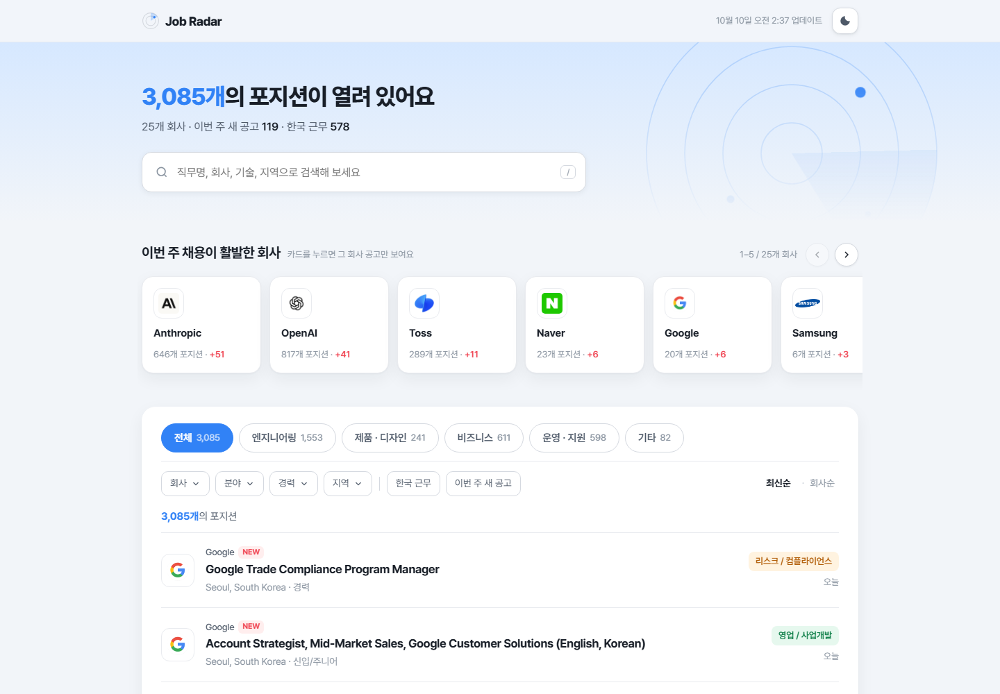

# Job Radar

> Personal job tracker that aggregates openings from 25 companies — AI labs, Korean tech, and physical / on-device AI — built to streamline my own job search.

[](https://python.org)
[](LICENSE)
[](https://github.com/features/actions)

**[Live Demo](https://donghee-ai.github.io/job-radar/)** • **[Architecture](ARCHITECTURE.md)**



---

## Why I Built This

Tired of checking multiple career pages every week, I built a unified dashboard that automatically aggregates job postings from companies I'm interested in — global AI labs (OpenAI, Anthropic), Korean tech (Naver, Toss, Samsung, LG, SK, 42dot), physical AI (Boston Dynamics, Figure AI, 1X, Physical Intelligence, Waymo …) and on-device AI silicon (Qualcomm, MediaTek, Intel, AMD).

## Features

- **Multi-source crawling** — Greenhouse, Ashby, Lever, Workday, Eightfold, Jibe, and custom JSON APIs
- **Role classification** — 16 roles in 4 families via weighted title rules (see [Role Classification](ARCHITECTURE.md#5-role-classification)); 87% on a held-out sample vs 66% for the previous keyword list
- **Seniority, region, new-posting tracking** — every posting gets a level (intern → lead), work regions, and the date it was first seen
- **Dashboard** — Korean job-board style (search hero, company logos, role-family tabs, dropdown filter chips with live counts), "Korea-based" / "new this week" toggles, sector filter (physical AI / on-device AI / AI labs), shareable URLs, dark mode, stale-data warnings
- **Related search** — Korean/English synonyms ("백엔드" also finds Backend, Server), related tech as weaker matches, one-letter typo tolerance, relevance ranking with highlighted matches (`docs/search.js`)
- **Self-healing daily runs** — a crawler that suddenly returns 0 keeps its previous postings for up to 7 days (then drops them so closed jobs don't linger), and every failure is reported with its cause on the dashboard, in the run log, and on the GitHub Actions run page
- **Zero-cost deployment** — static site + GitHub Actions

## Supported Companies

Each company uses a crawling strategy chosen to fit how its career page is built. See [ARCHITECTURE.md](ARCHITECTURE.md#4-crawling-techniques) for the rationale behind each approach.

| Company | Category | Sector | Crawling Method | Scope |
| ------- | -------- | ------ | --------------- | ----- |
| Anthropic | Global | AI lab | Greenhouse REST API | All |
| OpenAI | Global | AI lab | Ashby REST API | All |
| Google | Global | AI lab | Playwright + JS `evaluate()` | Korea |
| NVIDIA | Global | Physical / on-device | Playwright XHR interception (Workday) | Korea |
| Naver | IT | — | Internal AJAX JSON API | All |
| Samsung | Manufacturing | On-device | Playwright + BeautifulSoup | All |
| Toss | Finance | — | Playwright + BeautifulSoup | All |
| Upstage | Startup | AI lab | Requests + BeautifulSoup | All |
| LG AI연구원 | Conglomerate | AI lab / on-device | Greenhouse | All |
| LG전자 · 로보스타 | Conglomerate | Physical / on-device | LG Careers JSON API | These affiliates |
| SK하이닉스 · SK텔레콤 | Conglomerate | On-device | SK Careers list API | These affiliates |
| 42dot (Hyundai) | Conglomerate | Physical | Ashby | All |
| Boston Dynamics | Global | Physical | Workday JSON API | All |
| Figure AI, Skild AI, Agility Robotics, Waymo, Motional | Global | Physical | Greenhouse | All |
| 1X, Physical Intelligence, Wayve | Global | Physical | Ashby | All |
| Qualcomm | Global | On-device | Eightfold search API | Korea |
| Intel | Global | On-device | Workday JSON API | Korea |
| AMD | Global | On-device | Jibe search API | Korea |
| MediaTek | Global | On-device | tRPC JSON API | Korea |

Large chip vendors list thousands of global openings, so only their Korea-based postings are collected.

## Setup

### Requirements

- Python 3.11+
- Git

### Installation

```bash
# 1. Clone the repository
git clone https://github.com/donghee-ai/job-radar.git
cd job-radar

# 2. Create and activate a virtual environment
python -m venv venv

# Windows
venv\Scripts\activate
# Mac / Linux
# source venv/bin/activate

# 3. Install dependencies
pip install -r requirements.txt

# 4. Install Playwright browser binaries
#    (pip install alone is not enough — skipping this step breaks the Google/Samsung/Toss/NVIDIA crawlers)
playwright install chromium
```

### Usage

```bash
# Run all crawlers (companies enabled in config.json)
python main.py

# Run specific companies only
python main.py Google NVIDIA Toss

# Force-run every company
python main.py --all

# Re-apply role / seniority / region rules to existing data without crawling
python main.py --reclassify

# Check classifier accuracy against the labeled sets
python -m crawlers.classifier --eval

# Run the tests (also run by GitHub Actions on every push)
pip install pytest
python -m pytest tests

# Open the local dashboard
python server.py
```

### GitHub Pages Live Demo Setup (Optional)

1. GitHub repository → **Settings** → **Pages**
2. Source: `Deploy from a branch` → Branch: `main` / `docs` → Save
3. After a short delay, the site is available at `https://donghee-ai.github.io/job-radar/`

### GitHub Actions Automation (Optional)

To run the crawler automatically every day at 04:07 KST:

```bash
python toggle_schedule.py on   # Enable
python toggle_schedule.py off  # Disable
```

Once enabled, push the change and the workflow will run daily from that point on.

---

## Architecture

Python crawlers (`crawlers/`) → `docs/data/jobs.json` → static UI on GitHub Pages.
See [ARCHITECTURE.md](ARCHITECTURE.md) for details.
